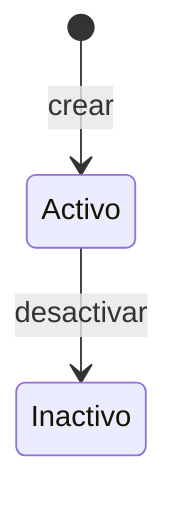

# ADR-0002: Estrategia de Chunking Semántico por Tipo KDD

---
id: ADR-0002
status: superseded
superseded_note: "Migración a TypeScript/Bun (Feb 2026). El chunking ahora es paragraph-level genérico (src/application/chunking.ts) con selección de secciones embeddables por kind via embeddableSections(). No hay estrategias por tipo — un solo chunkDocument() para todos los kinds."
date: 2025-01-16
deciders: [leopoldo, claude]
consulted: []
informed: []
related_dc: DC-004
supersedes: null
superseded_by: null
---

## Contexto

El sistema necesita dividir documentos KDD en chunks para generar embeddings. A diferencia de un RAG genérico, conocemos la estructura exacta de los documentos (metodología KDD) lo que nos permite un chunking más inteligente.

Requisitos:
- Chunks semánticamente coherentes (no cortar mitad de concepto)
- Preservar metadatos (sección, tipo de contenido)
- Respetar límites del modelo de embedding (~512 tokens típico)
- Manejar contenido especial (tablas, código, Mermaid)

Se evaluaron 5 opciones:
- Tamaño fijo con overlap
- Por secciones Markdown (H2/H3)
- Por tipo de documento KDD (estrategia específica)
- Jerárquico (multi-nivel tipo RAPTOR)
- Híbrido (secciones + subdivisión)

## Decisión

**Adoptamos Chunking Semántico por Tipo KDD con fallback híbrido.**

Cada tipo de documento KDD tiene su propia estrategia de chunking que entiende su estructura, con subdivisión automática si una sección excede el límite de tokens.

### Arquitectura

```python
from abc import ABC, abstractmethod
from typing import List, Optional
from dataclasses import dataclass, field
from enum import Enum

# ============================================================
# CONFIGURACIÓN
# ============================================================

@dataclass
class ChunkingConfig:
    max_tokens: int = 512          # Límite por chunk
    overlap_tokens: int = 50        # Overlap en subdivisiones
    min_chunk_tokens: int = 50      # Mínimo para crear chunk
    preserve_code_blocks: bool = True
    preserve_tables: bool = True
    preserve_mermaid: bool = True
    embedding_model: str = "text-embedding-3-small"


class ChunkType(str, Enum):
    """Tipos de chunk semánticos — implementados en kdd_engine.core.models.document."""
    ENTITY = "entity"
    USE_CASE = "use_case"
    RULE = "rule"
    PROCESS = "process"
    DEFAULT = "default"


@dataclass
class Chunk:
    id: str
    document_id: str
    sequence: int
    content: str
    chunk_type: ChunkType
    section_name: Optional[str] = None
    metadata: dict = field(default_factory=dict)
    content_hash: str = ""
    token_count: int = 0
    lifecycle_state: str = "dev"


# ============================================================
# ESTRATEGIA BASE
# ============================================================

class ChunkingStrategy(ABC):
    """Interfaz base para estrategias de chunking."""

    def __init__(self, config: ChunkingConfig):
        self.config = config

    @abstractmethod
    def chunk(self, document: "Document") -> List[Chunk]:
        """Divide el documento en chunks."""
        ...

    def subdivide_if_needed(
        self,
        content: str,
        chunk_type: ChunkType,
        section_name: str,
        base_metadata: dict
    ) -> List[Chunk]:
        """Subdivide contenido si excede max_tokens, preservando párrafos."""
        token_count = self.count_tokens(content)

        if token_count <= self.config.max_tokens:
            return [self._create_chunk(content, chunk_type, section_name, base_metadata)]

        # Subdividir preservando párrafos
        chunks = []
        paragraphs = self._split_into_paragraphs(content)
        current_content = ""
        current_tokens = 0

        for para in paragraphs:
            para_tokens = self.count_tokens(para)

            if current_tokens + para_tokens > self.config.max_tokens:
                if current_content:
                    chunks.append(self._create_chunk(
                        current_content,
                        ChunkType.SUBDIVISION,
                        section_name,
                        {**base_metadata, "parent_type": chunk_type.value}
                    ))
                current_content = para
                current_tokens = para_tokens
            else:
                current_content += "\n\n" + para if current_content else para
                current_tokens += para_tokens

        if current_content and current_tokens >= self.config.min_chunk_tokens:
            chunks.append(self._create_chunk(
                current_content,
                ChunkType.SUBDIVISION,
                section_name,
                {**base_metadata, "parent_type": chunk_type.value}
            ))

        return chunks

    def count_tokens(self, text: str) -> int:
        """Cuenta tokens usando tiktoken o aproximación."""
        # Implementación real usaría tiktoken
        return len(text.split()) * 1.3  # Aproximación

    def _split_into_paragraphs(self, content: str) -> List[str]:
        """Divide contenido en párrafos preservando bloques especiales."""
        # Preservar bloques de código, tablas, mermaid
        # Implementación simplificada
        return [p.strip() for p in content.split("\n\n") if p.strip()]

    def _create_chunk(
        self,
        content: str,
        chunk_type: ChunkType,
        section_name: str,
        metadata: dict
    ) -> Chunk:
        """Crea un chunk con metadatos."""
        import hashlib
        return Chunk(
            id="",  # Se asigna después
            document_id="",  # Se asigna después
            sequence=0,  # Se asigna después
            content=content,
            chunk_type=chunk_type,
            section_name=section_name,
            metadata=metadata,
            content_hash=hashlib.sha256(content.encode()).hexdigest()[:16],
            token_count=int(self.count_tokens(content))
        )


# ============================================================
# ESTRATEGIAS POR TIPO KDD
# ============================================================

class EntityChunker(ChunkingStrategy):
    """
    Chunking para documentos de tipo Entity.

    Estructura esperada:
    - Descripción
    - Atributos (tabla)
    - Relaciones (tabla)
    - Ciclo de Vida (Mermaid + tabla)
    - Invariantes
    - Eventos
    """

    def chunk(self, document: "Document") -> List[Chunk]:
        chunks = []
        sections = self._parse_sections(document.content)
        base_meta = {"kind": "entity", "entity_name": document.metadata.get("name")}

        # Chunk 1: Descripción general
        if desc := sections.get("descripcion") or sections.get("description"):
            chunks.extend(self.subdivide_if_needed(
                desc, ChunkType.DESCRIPTION, "Descripción", base_meta
            ))

        # Chunk 2: Atributos (mantener tabla completa si posible)
        if attrs := sections.get("atributos") or sections.get("attributes"):
            chunks.extend(self.subdivide_if_needed(
                attrs, ChunkType.ATTRIBUTES, "Atributos", base_meta
            ))

        # Chunk 3: Relaciones
        if rels := sections.get("relaciones") or sections.get("relations"):
            chunks.extend(self.subdivide_if_needed(
                rels, ChunkType.RELATIONS, "Relaciones", base_meta
            ))

        # Chunk 4: Ciclo de vida (diagrama + descripción)
        if lifecycle := sections.get("ciclo de vida") or sections.get("lifecycle"):
            chunks.extend(self.subdivide_if_needed(
                lifecycle, ChunkType.LIFECYCLE, "Ciclo de Vida", base_meta
            ))

        # Chunk 5: Invariantes
        if invs := sections.get("invariantes") or sections.get("invariants"):
            chunks.extend(self.subdivide_if_needed(
                invs, ChunkType.INVARIANTS, "Invariantes", base_meta
            ))

        # Chunk 6: Eventos
        if events := sections.get("eventos") or sections.get("events"):
            chunks.extend(self.subdivide_if_needed(
                events, ChunkType.EVENTS, "Eventos", base_meta
            ))

        return self._assign_sequences(chunks, document.id)

    def _parse_sections(self, content: str) -> dict:
        """Parsea secciones H2 del documento."""
        sections = {}
        current_section = None
        current_content = []

        for line in content.split("\n"):
            if line.startswith("## "):
                if current_section:
                    sections[current_section.lower()] = "\n".join(current_content)
                current_section = line[3:].strip()
                current_content = []
            else:
                current_content.append(line)

        if current_section:
            sections[current_section.lower()] = "\n".join(current_content)

        return sections

    def _assign_sequences(self, chunks: List[Chunk], doc_id: str) -> List[Chunk]:
        for i, chunk in enumerate(chunks):
            chunk.document_id = doc_id
            chunk.sequence = i
        return chunks


class UseCaseChunker(ChunkingStrategy):
    """
    Chunking para documentos de tipo UseCase.

    Estructura esperada:
    - Actor Principal
    - Precondiciones
    - Garantías (mínimas y de éxito)
    - Flujo principal
    - Extensiones/alternativas
    - Postcondiciones
    - Reglas invocadas, Eventos producidos
    """

    def chunk(self, document: "Document") -> List[Chunk]:
        chunks = []
        sections = self._parse_sections(document.content)
        base_meta = {"kind": "use_case", "uc_id": document.metadata.get("id")}

        # Chunk 1: Contexto (Actor + Pre + Garantías)
        context_parts = []
        for key in ["actor principal", "preconditions", "minimal guarantees", "success_guarantees"]:
            if section := sections.get(key):
                context_parts.append(f"## {key.title()}\n{section}")

        if context_parts:
            chunks.extend(self.subdivide_if_needed(
                "\n\n".join(context_parts),
                ChunkType.PRECONDITIONS,
                "Contexto",
                base_meta
            ))

        # Chunk 2: Flujo principal
        if flow := sections.get("flujo principal") or sections.get("main flow"):
            chunks.extend(self.subdivide_if_needed(
                flow, ChunkType.MAIN_FLOW, "Flujo Principal", base_meta
            ))

        # Chunk 3+: Extensiones (cada extensión puede ser un chunk)
        if exts := sections.get("extensiones") or sections.get("extensions"):
            extension_chunks = self._parse_extensions(exts, base_meta)
            chunks.extend(extension_chunks)

        # Chunk N: Postcondiciones + Referencias
        post_parts = []
        for key in ["postcondiciones", "postconditions", "invokes rules", "produces events"]:
            if section := sections.get(key):
                post_parts.append(f"## {key.title()}\n{section}")

        if post_parts:
            chunks.extend(self.subdivide_if_needed(
                "\n\n".join(post_parts),
                ChunkType.POSTCONDITIONS,
                "Postcondiciones",
                base_meta
            ))

        return self._assign_sequences(chunks, document.id)

    def _parse_extensions(self, content: str, base_meta: dict) -> List[Chunk]:
        """Parsea extensiones individuales como chunks separados."""
        chunks = []
        # Patrón: "2a. Descripción de la extensión"
        import re
        extensions = re.split(r'\n(?=\d+[a-z]\.\s)', content)

        for ext in extensions:
            if ext.strip():
                chunks.extend(self.subdivide_if_needed(
                    ext.strip(),
                    ChunkType.EXTENSION,
                    "Extensión",
                    {**base_meta, "is_extension": True}
                ))

        return chunks

    def _parse_sections(self, content: str) -> dict:
        """Parsea secciones del documento."""
        sections = {}
        current_section = None
        current_content = []

        for line in content.split("\n"):
            if line.startswith("## "):
                if current_section:
                    sections[current_section.lower()] = "\n".join(current_content)
                current_section = line[3:].strip()
                current_content = []
            else:
                current_content.append(line)

        if current_section:
            sections[current_section.lower()] = "\n".join(current_content)

        return sections

    def _assign_sequences(self, chunks: List[Chunk], doc_id: str) -> List[Chunk]:
        for i, chunk in enumerate(chunks):
            chunk.document_id = doc_id
            chunk.sequence = i
        return chunks


class RuleChunker(ChunkingStrategy):
    """
    Chunking para documentos de tipo Rule.

    Estructura esperada:
    - Descripción
    - Tabla de decisión
    - Especificación ejecutable (YAML)
    """

    def chunk(self, document: "Document") -> List[Chunk]:
        chunks = []
        sections = self._parse_sections(document.content)
        base_meta = {"kind": "rule", "rule_id": document.metadata.get("id")}

        # Las reglas suelen ser cortas, intentar mantener completas
        # Chunk 1: Descripción + Tabla de decisión
        main_content = document.content
        if self.count_tokens(main_content) <= self.config.max_tokens:
            chunks.append(self._create_chunk(
                main_content,
                ChunkType.DECISION_TABLE,
                "Regla Completa",
                base_meta
            ))
        else:
            # Si es muy larga, separar tabla de descripción
            if desc := sections.get("descripcion"):
                chunks.extend(self.subdivide_if_needed(
                    desc, ChunkType.DESCRIPTION, "Descripción", base_meta
                ))

            # Buscar tabla markdown
            if table := self._extract_table(document.content):
                chunks.append(self._create_chunk(
                    table, ChunkType.DECISION_TABLE, "Tabla de Decisión", base_meta
                ))

        return self._assign_sequences(chunks, document.id)

    def _extract_table(self, content: str) -> Optional[str]:
        """Extrae tabla markdown del contenido."""
        lines = content.split("\n")
        table_lines = []
        in_table = False

        for line in lines:
            if "|" in line:
                in_table = True
                table_lines.append(line)
            elif in_table and line.strip() == "":
                break

        return "\n".join(table_lines) if table_lines else None

    def _parse_sections(self, content: str) -> dict:
        sections = {}
        current_section = "descripcion"
        current_content = []

        for line in content.split("\n"):
            if line.startswith("## "):
                sections[current_section.lower()] = "\n".join(current_content)
                current_section = line[3:].strip()
                current_content = []
            else:
                current_content.append(line)

        sections[current_section.lower()] = "\n".join(current_content)
        return sections

    def _assign_sequences(self, chunks: List[Chunk], doc_id: str) -> List[Chunk]:
        for i, chunk in enumerate(chunks):
            chunk.document_id = doc_id
            chunk.sequence = i
        return chunks


class ProcessChunker(ChunkingStrategy):
    """Chunking para documentos de tipo Process."""

    def chunk(self, document: "Document") -> List[Chunk]:
        chunks = []
        base_meta = {"kind": "process", "process_id": document.metadata.get("id")}

        # Los procesos suelen tener diagramas Mermaid
        # Mantener diagrama + descripción juntos si posible

        if self.count_tokens(document.content) <= self.config.max_tokens:
            chunks.append(self._create_chunk(
                document.content,
                ChunkType.PROCESS_FLOW,
                "Proceso Completo",
                base_meta
            ))
        else:
            chunks.extend(self.subdivide_if_needed(
                document.content,
                ChunkType.PROCESS_FLOW,
                "Proceso",
                base_meta
            ))

        return self._assign_sequences(chunks, document.id)

    def _assign_sequences(self, chunks: List[Chunk], doc_id: str) -> List[Chunk]:
        for i, chunk in enumerate(chunks):
            chunk.document_id = doc_id
            chunk.sequence = i
        return chunks


class DefaultChunker(ChunkingStrategy):
    """
    Chunking por defecto para tipos no especializados.
    Usa secciones H2 con fallback a subdivisión.
    """

    def chunk(self, document: "Document") -> List[Chunk]:
        chunks = []
        sections = self._parse_sections(document.content)
        base_meta = {"kind": document.metadata.get("kind", "unknown")}

        for section_name, content in sections.items():
            if content.strip():
                chunks.extend(self.subdivide_if_needed(
                    content,
                    ChunkType.FULL_SECTION,
                    section_name,
                    base_meta
                ))

        return self._assign_sequences(chunks, document.id)

    def _parse_sections(self, content: str) -> dict:
        sections = {}
        current_section = "intro"
        current_content = []

        for line in content.split("\n"):
            if line.startswith("## "):
                if current_content:
                    sections[current_section] = "\n".join(current_content)
                current_section = line[3:].strip()
                current_content = []
            else:
                current_content.append(line)

        if current_content:
            sections[current_section] = "\n".join(current_content)

        return sections

    def _assign_sequences(self, chunks: List[Chunk], doc_id: str) -> List[Chunk]:
        for i, chunk in enumerate(chunks):
            chunk.document_id = doc_id
            chunk.sequence = i
        return chunks


# ============================================================
# FACTORY
# ============================================================

class ChunkerFactory:
    """Factory para obtener el chunker apropiado según tipo de documento."""

    _chunkers = {
        "entity": EntityChunker,
        "use_case": UseCaseChunker,
        "rule": RuleChunker,
        "process": ProcessChunker,
        # Añadir más según se implementen
    }

    @classmethod
    def get_chunker(cls, doc_kind: str, config: ChunkingConfig) -> ChunkingStrategy:
        """Retorna el chunker apropiado para el tipo de documento."""
        chunker_class = cls._chunkers.get(doc_kind, DefaultChunker)
        return chunker_class(config)

    @classmethod
    def register_chunker(cls, doc_kind: str, chunker_class: type):
        """Registra un nuevo chunker para un tipo de documento."""
        cls._chunkers[doc_kind] = chunker_class
```

### Ejemplo de Uso

```python
# Configuración
config = ChunkingConfig(
    max_tokens=512,
    overlap_tokens=50,
    embedding_model="text-embedding-3-small"
)

# Documento de tipo Entity
entity_doc = Document(
    id="doc-123",
    kind="entity",
    content="""
## Descripción
Usuario representa a una persona...

## Atributos
| Atributo | Tipo | Descripción |
|----------|------|-------------|
| id | uuid | Identificador único |
| email | string | Email del usuario |

## Relaciones
| Relación | Cardinalidad | Entidad |
|----------|--------------|---------|
| pertenece a | N:1 | Organización |

## Ciclo de Vida

""",
    metadata={"name": "Usuario"}
)

# Obtener chunker y procesar
chunker = ChunkerFactory.get_chunker(entity_doc.kind, config)
chunks = chunker.chunk(entity_doc)

# Resultado: chunks semánticos con type=ENTITY
# Cada chunk de un documento Entity recibe chunk_type=ENTITY
```

## Justificación

1. **Conocimiento de estructura**: KDD define estructuras claras por tipo de documento. Aprovechar esto produce chunks más coherentes que chunking genérico.

2. **Metadatos ricos**: Cada chunk sabe su tipo (DESCRIPTION, MAIN_FLOW, etc.), permitiendo retrieval más preciso.

3. **Inspirado en GraphRAG**: TextUnits de ~300-500 tokens respetando límites semánticos.

4. **Fallback robusto**: Si una sección excede el límite, se subdivide preservando párrafos.

5. **Extensible**: Añadir nuevo tipo KDD = implementar nuevo Chunker + registrar en factory.

## Alternativas Consideradas

### Alternativa 1: Tamaño Fijo

Chunks de 512 tokens con overlap de 50.

**Descartada porque**:
- Rompe coherencia semántica
- No aprovecha estructura conocida
- Pierde contexto de sección

### Alternativa 2: Solo Secciones H2

Cada sección H2 es un chunk.

**Descartada porque**:
- Secciones muy largas exceden límite
- No diferencia tipos de contenido dentro de sección

### Alternativa 3: Jerárquico tipo RAPTOR

Árbol de resúmenes multinivel.

**Descartada porque**:
- Overhead de LLM para summarización
- Pierde detalle en niveles altos
- Más complejo sin beneficio claro para KDD

## Consecuencias

### Positivas

- Chunks semánticamente coherentes
- Retrieval puede filtrar por chunk_type
- Metadatos permiten reranking inteligente
- Fácil añadir nuevos tipos KDD

### Negativas

- Requiere mantener chunker por tipo
- Documentos mal formateados pueden producir chunks subóptimos
- Más código que chunking genérico

### Riesgos

| Riesgo | Probabilidad | Impacto | Mitigación |
|--------|--------------|---------|------------|
| Documento no sigue estructura esperada | Media | Bajo | DefaultChunker como fallback |
| Sección especial no reconocida | Media | Bajo | Parsing flexible, logs de warning |
| Cambio en plantilla KDD | Baja | Medio | Chunkers son configurables |

## Plan de Implementación

- [x] Crear módulo `kdd_engine.chunking`
- [x] Implementar ChunkingStrategy base
- [x] Implementar EntityChunkingStrategy
- [x] Implementar UseCaseChunkingStrategy
- [x] Implementar RuleChunkingStrategy
- [x] Implementar ProcessChunkingStrategy
- [x] Implementar DefaultChunkingStrategy
- [x] Crear ChunkerFactory
- [x] Tests unitarios por chunker
- [x] Integrar con IndexationPipeline

## Referencias

- [Design Challenge DC-004](../challenges/DC-004-chunking-strategy.md)
- [GraphRAG TextUnits](https://microsoft.github.io/graphrag/index/default_dataflow/)
- [Metodología KDD](../kdd.md)
